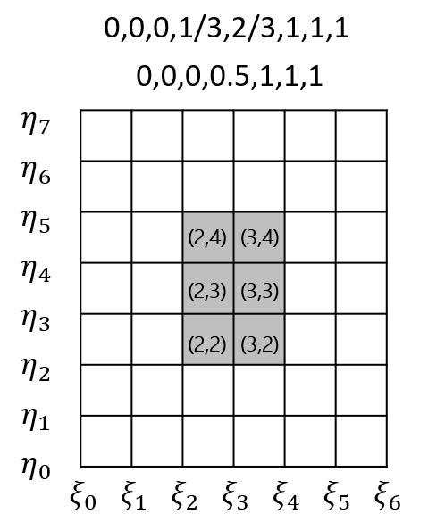

# Abasys Manual

*如何标识一个单元？*
用节点(u, v)所在的节点区间的下标标识一个单元

获取曲面上一个节点对(u,v)所在的单元可以这样写：

~~~C++
int ei = tinynurbs::findSpan(surf.degree_u, surf.knots_u, u);
int ej = tinynurbs::findSpan(surf.degree_v, surf.knots_v, v);
~~~

所以遍历一个nurbs曲面的所有单元可以这样写

~~~C++
for (int ei = deg_u; ei < surf.control_points.rows(); ++ei) {
    for (int ej = deg_v; ej < surf.control_points.cols(); ++ej) {
    ...
    ...
}
~~~

## Glossary

vec3 三维坐标点，（x，y，z）
hvec3 带权坐标点，（x，y，z，w）
points 三维坐标点集合
hpoints 带权坐标点集合

